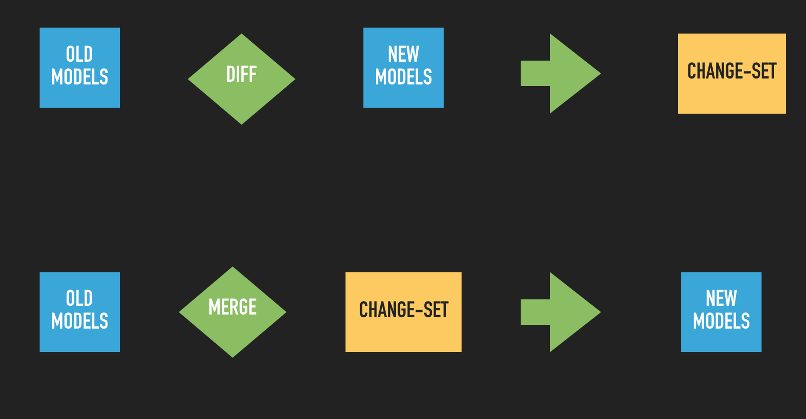

<div align="center">
  <br><br>
</div>

-----------------

# Fast Diff 

General purpose, fast diff algorithm supporting [m] level nested diffs. 

## Time Complexity
- Linear i.e. O(n)

## Why?
1. Faster than the mainstream algorithm. Most diffing algorithm are O(nlogn) or O(n.m). This one is linear O(n).
2. Most algorithm solve Least Common Subsequence problem which has hard to grasp implementation. This uses 6 simple looping passes.
3. Supports nested diffing (if you desire)

## Installation
### Via cocoapods
```swift
pod 'FastDiff'
```
And then in the terminal `pod update`. If you are new to cocoapods please check out [Cocoapods Installation](https://guides.cocoapods.org/using/using-cocoapods)

### Via Swift Package Manager
Declare the dependency in the swift `Package.swift` file like such:
```swift
dependencies: [
  ///.... other deps
  .package(url: "https://www.github.com/kandelvijaya/FastDiff", from: "1.0.0"),
]
```

Execute the update command `swift package update` and then `swift package generate-xcodeproj`.

## Running the tests

Go to the source directory, and run:
```swift
$ swift test
```

## Usage
   
### Algorithm & Verification
```swift
let oldModels = ["apple", "microsoft"]
let newModels = ["apple", "microsoft", "tesla"]


/// Algorithm
let changeSet = diff(oldModels, newModels)
// [.addition("tesla", at: 2)]


/// Verification
oldModels.merged(with: changeSet) == newModels 
// true
```

<div align="center">
  <br><br>
</div>


Note that `diff` produces changeset that can't be merged into old collections as is, most of the times. 
The changeset has to be `ordered` in-order for successful merge. This is also useful if you want to
apply changeset to `UITableView` or `UICollectionView`.

```swift
let chnageSet = diff(["A","B"], [“C”,"D"])
// [.delete("A",0), .delete("B",1), .add("C",0), .add(“D",1)]

let orderedChangeSet = orderedOperation(from: changeSet)
// [.delete("B",1), .delete("A",0), .add("C",0), .add("D",1)]

```

### Advanced usage & notes
1. This algorithm works accurately with value types `Struct`'s. Please refrain from using reference type (`Class` instance). When you must use class instance / object, you might get more updates than you expect. If you want to resolve this issue for your use case please DM me www.twitter.com/kandelvijaya
2. Tree diffing is possible. However not something the library encourages due to added complexity O(n^2). If you so choose to diff then please use `diffAllLevel(,)`
3. The complexity of Graph diffing depends on graph structure. For Trees, its O(n^2). Please note that this change set is not mergeable to the original tree. To circumvent this limitation, use a node with indexes or indepath that points to the graph position implicitly. 

### Concept and advanced usage in List View Controller (iOS)
Please check out this presentation slides that I gave at [@mobiconf 2018](https://drive.google.com/file/d/1eY0k_5sHBDgK6Qx6-VR3HTmCQEi9qaW3/view?usp=sharing)
  


## Why is nested diffing important? Tutorial/HowTo 
Say you got a list of Component where each is defined as:

```swift
struct Component {
  let title: String 
  let footer: FooterViewModel?  // useful on top levels 
  let children: [Component]?  // nil when its a leaf. 
  let icons_sf: [String] 
}
```

Say we got this model represented in the UI using CollectionView sections. `Today` and `Tomorrow` are represented by SectionHeaderSupplemenratyViews and so are corresponding footers. The internalItems are represented by `TaskCell`. User has the ability to add new task using NavBar Button. 

```swift
let old = [

  Component(title: "Today", footer: .init(), icons_sf: ["1.fill", "2.circle"], children: [
    Component(title: "Go to supermarket", footer: nil, icons_sf: ["sf.cucumber"], children: nil), 
    Component(title: "Make breakfast", footer: nil, icons_sf: ["sf.avocado"], children: nil)
  ]), 

  Component(title: "Tomorrow", footer: .init(), icons_sf: ["1.fill", "2.circle"], children: [
    Component(title: "Work on FastDiff", footer: nil, icons_sf: ["sf.chopsticks"], children: nil), 
    Component(title: "SwiftUI TODO list for macos", footer: nil, icons_sf: ["sf.pen"], children: nil)
  ])

]
```

Say user adds a new task item to Todays entry therefore changing the new model becomes:
```swift
let new = [

  Component(title: "Today", footer: .init(), icons_sf: ["1.fill", "2.circle"], children: [
    Component(title: "Go to supermarket", footer: nil, icons_sf: ["sf.cucumber"], children: nil), 
    Component(title: "Make breakfast", footer: nil, icons_sf: ["sf.avocado"], children: nil), 

    /// newly added
    Component(title: "Buy PS5 from amazon", footer: nil, icons_sf: ["sf.play"], children: nil), 
  ]), 

  Component(title: "Tomorrow", footer: .init(), icons_sf: ["1.fill", "2.circle"], children: [
    Component(title: "Work on FastDiff", footer: nil, icons_sf: ["sf.chopsticks"], children: nil), 
    Component(title: "SwiftUI TODO list for macos", footer: nil, icons_sf: ["sf.pen"], children: nil)
  ])

]
```

We assume `Component: Diffable`

### What is your expectation when you perform `diff(old, new)`?
There can be 2 potential solutions:

1. `[.delete(item: old.0, at: 0), insert(item: new.0, at 0)]`

    - diffable conformance can look like this:
      ```swift 
      extension Component: Diffable {}
      ```
    - UI side: you would remove the entire 1st section, construct new section and insert it. This throws away the enitre section when we know 2 internal items (cell) didn't change across old and new. 
    - We wasted a bit of resource. 
    - We won't get insertion animation for the excat change. 

2. `[.update(at: 0, old: old.0, new: new.0)]`
    - diffable conformance will look like this:
      ```swift
      extension Component: Diffable, Equatable {
        
        var diffHash: Int {
          /// excludes innerDiffItems 
          return title.hashValue ^ footer.hashValue ^ icons_sf.hashValue
        }

        var innerDiffableItems: [Component] {
          return children ?? []
        }

      }
      ```
      - UI side: when receiving `.update(,,,)` on section level, we can perform diff on internal items like so `diff(old.innerDiffableItems, new.innerDiffableItems)` to receive exact changes on cell level which can then be patched to `section.performBatchUpdate`
      - New task addition is animated, its the only thing that changed on the UI
      - Effecient patching of changed content. 


## Authors

1. @kandelvijaya (https://twitter.com/kandelvijaya)

## License

This project is licensed under the MIT License - see the [LICENSE.md](LICENSE.md) file for details

## Acknowledgments

* Inspired by Paul Heckel's paper & algorithm
